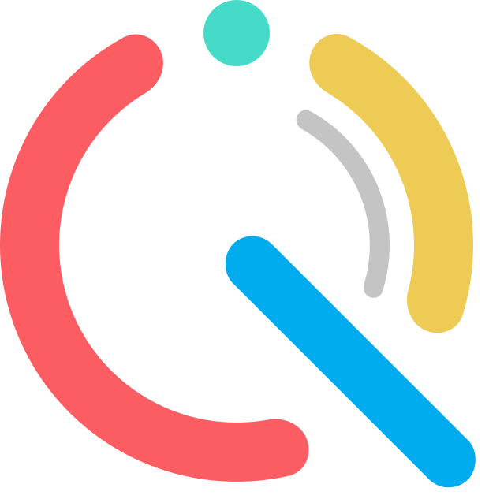

## 目次
- [アプリケーションについて](https://github.com/TakuyaYagishita0202/laravel_timetracker#Quitter)
    - [デモ](https://github.com/TakuyaYagishita0202/laravel_timetracker#デモ)
- [技術スタック](https://github.com/TakuyaYagishita0202/laravel_timetracker#技術スタック)
    - [サーバーサイド](https://github.com/TakuyaYagishita0202/laravel_timetracker#サーバーサイド)
    - [クライアントサイド](https://github.com/TakuyaYagishita0202/laravel_timetracker#クライアントサイド)
- [スクリーンショット](https://github.com/TakuyaYagishita0202/laravel_timetracker#スクリーンショット)
- [今後の改善点]()
- その他
    - [デザインについて](https://github.com/TakuyaYagishita0202/laravel_timetracker#デザインについて)
    - [素材](https://github.com/TakuyaYagishita0202/laravel_timetracker#素材)

## Quitter
### 「三日坊主を卒業しましょう。」
QuitterはVue.jsとLaravelで構築されたシンプルなタイムトラッキングアプリです。プログラミングやデザイン、語学や資格取得に向けた学習など、ユーザーの日々の自己投資時間を見える化することでモチベーションの維持に繋げ、習慣化のサポートができればという思いから開発されました。

ちなみに、アプリケーション名の「Quitter」には英語で「三日坊主」という意味があり、quitterにはならないで！という開発者の思いが込められています。某SNSアプリを意識したつもりは毛頭ございませんのでご容赦ください…（笑）

### デモ
[Quitter](https://quitter-app-beta.herokuapp.com/login)

- メールアドレス：test@qmail.com
- パスワード：12345678

上記を入力いただくか、「お試しログイン」よりデモユーザーでログインができます。なお、デモユーザーのデータについては一定期間後、初期化されますのでご注意ください。

## 技術スタック
使用している主な技術(ライブラリ含む)は以下です。
### サーバーサイド
- [Laravel](https://github.com/laravel/laravel)
- [Carbon](https://github.com/briannesbitt/carbon): 日付時刻操作

### クライアントサイド
- [Vue.js](https://github.com/vuejs/vue)
- [Vuex](https://github.com/vuejs/vuex): 主にログインユーザーに関する状態管理
- [Vue-router](https://github.com/vuejs/vue-router): クライアントサイドのルート
- [Axios](https://github.com/axios/axios): HTTPリクエスト
- [Vuetify](https://github.com/vuetifyjs/vuetify): コンポーネントフレームワーク
- [moment.js](https://github.com/moment/moment/): 日付時刻操作
- [Vue-echarts](https://github.com/ecomfe/vue-echarts)([Echarts](https://echarts.apache.org/en/index.html)): データビジュアライゼーション
- [canvas-confetti](https://github.com/catdad/canvas-confetti): タイマー終了時のアニメーション

## スクリーンショット
#### ログイン / 会員登録

#### タイマー画面

#### ダッシュボード

#### フォーム

#### タイマー作動中~記録終了

#### ナビゲーションドロワー

### モバイル
- [タイマー画面](https://github.com/TakuyaYagishita0202/laravel_timetracker/wiki/images/sp_Timer.png)
- [ダッシュボード](https://github.com/TakuyaYagishita0202/laravel_timetracker/wiki/images/sp_Dashboard.png)

## 今後の改善点
- プロジェクトの[Todo]()をご確認ください。

## その他
### デザイン
画面設計及びロゴのデザインには[Figma](https://www.figma.com/)を、ナビゲーションドロワーの背景画像作成には[Canva](https://www.canva.com/)を使用しました。
- [画面設計](https://www.figma.com/file/QwnEB6S8IKpwUbaeeLWaMF/Inter-Face?node-id=4%3A99)
- [ロゴ](https://www.figma.com/file/ZPg5Pplfxt85twoL6m5xKr/Quitter_Logo?node-id=0%3A1)
### 素材
以下のフリー素材を活用させていただきました。
- [unDraw](https://undraw.co/)
- [DrawKit](https://www.drawkit.io/)
- [Free avatars flat icons](https://www.behance.net/gallery/47035405/Free-avatars-flat-icons)